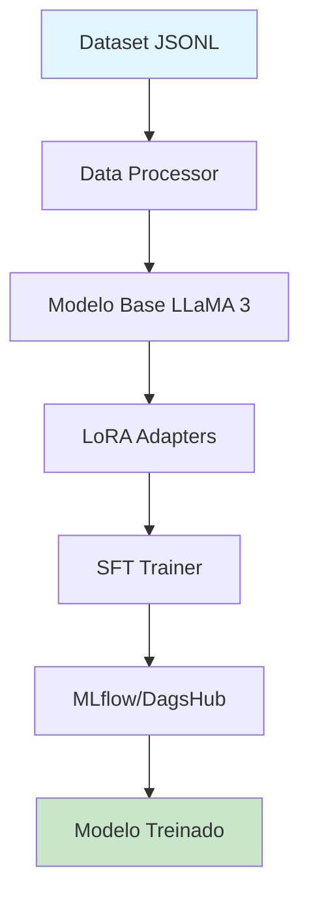

<p align="center">
  
  
  
  
</p>

<h1 align="center">
  [=^.^=] PurrTune
</h1>

<h3 align="center">
  <em>Fine-tuning de LLMs que ronrona suave na sua GPU</em>
</h3>

<p align="center">

```
⠀⠀⠀⠀⠀⠀⠀⠀⠀⠀⠀⠀⠀⠀⠀⠀⠀⠀⠀⠀⠀⠀⠀⠀⢠⣶⣶⣶⣴⣦⣄⣄⡀⠀⠀⠀⠀⠀⠀⠀⠀
⠀⠀⠀⠀⠀⠀⠀⠀⠀⠀⠀⠀⠀⠀⠀⠀⠀⠀⠀⠀⠀⠀⠀⠀⠈⠻⠿⣿⣿⣿⣿⣿⣿⣷⣀⠀⠀⠀⠀⠀⠀
⠀⠀⠀⠀⠀⠀⠀⠀⠀⠀⠀⠀⠀⠀⠀⠀⠀⠀⠀⠀⠀⠀⠀⠀⠀⠀⠀⠀⠀⠉⠻⣿⣿⣿⣿⣧⡀⠀⠀⠀⠀
⠀⠀⠀⠀⠀⠀⠀⠀⠀⠀⠀⠀⠀⠀⠀⠀⠀⠀⠀⠀⠀⠀⠀⠀⠀⠀⠀⠀⠀⠀⠀⢹⣿⣿⣿⣿⣏⠀⠀⠀⠀
⠀⠀⠀⠀⠀⠀⠀⠀⠀⠀⠀⠀⠀⠀⠀⠀⠀⠀⠀⠀⠀⠀⠀⠀⠀⠀⠀⠀⠀⠀⠀⢀⣿⣿⣿⣿⡟⠀⠀⠀⠀
⠀⠀⠀⠀⠀⠀⠀⠀⠀⠀⠀⠀⠀⠀⠀⠀⠀⠀⠀⠀⠀⠀⠀⠀⠀⠀⠀⠀⠀⠀⠀⣼⣿⣿⣿⣿⣿⠁⠀⠀⠀
⢀⠀⠀⠀⠀⠀⠀⠀⠀⠀⠀⠀⠀⠀⠀⠀⠀⠀⠀⠀⠀⠀⠀⠀⠀⠀⠀⠀⠀⠀⣀⣿⣿⣿⣿⣿⡟⠀⠀⠀⠀
⠈⢻⣿⣿⣶⣦⣤⣀⣴⣶⣶⣤⣄⣀⠀⠀⠀⠀⠀⠀⠀⠀⠀⠀⠀⠀⠀⠀⠀⢀⣿⣿⣿⣿⣿⣿⠁⠀⠀⠀⠀
⠀⠀⠘⣿⣿⣿⣿⣿⣿⣿⣿⣿⣿⣿⣿⣿⣧⣤⣀⡀⠀⠀⠀⠀⠀⠀⠀⠀⠀⢸⣿⣿⣿⣿⣿⣟⠀⠀⠀⠀⠀
⠀⠀⠀⠈⢿⣿⣿⣿⣿⣿⣿⣿⣿⣿⣿⣿⣿⣿⣿⣿⣷⣦⡀⠀⠀⠀⠀⠀⠀⣿⣿⣿⣿⣿⣿⡇⠀⠀⠀⠀⠀
⠀⠀⠀⠀⢀⣿⣿⣿⣿⣿⣿⣿⣿⣿⣿⣿⣿⣿⣿⣿⣿⣿⣿⣦⣄⠀⠀⠀⢠⣿⣿⣿⣿⣿⣿⠀⠀⠀⠀⠀⠀
⠀⠀⠀⢠⣿⣿⣿⣿⣿⣿⣿⣿⣿⣿⣿⣿⣿⣿⣿⣿⣿⣿⣿⣿⣿⣿⣿⣷⣾⣿⣿⣿⣿⣿⣿⠀⠀⠀⠀⠀⠀
⠀⠀⠀⣿⣿⣿⣿⣿⣿⣿⣿⣿⣿⣿⣿⣿⣿⣿⣿⣿⣿⣿⣿⣿⣿⣿⣿⣿⣿⣿⣾⣿⣿⣿⣿⡄⠀⠀⠀⠀⠀
⠀⠀⢰⣿⣿⣿⣿⣿⣿⣿⣿⣿⣿⣿⣿⣿⣿⣿⣿⣿⣿⣿⣿⣿⣿⣿⣿⣿⣿⣿⣿⣿⣿⣿⣿⣷⡀⠀⠀⠀⠀
⠀⠀⠀⢻⣿⣿⣟⣿⡿⣿⣿⣿⣿⣿⣿⣿⣿⣿⣿⣿⣿⣿⣿⣿⣿⣿⣿⣿⣿⣿⣿⣿⣿⣿⣿⣿⣷⣦⠀⠀⠀
⠀⠀⠀⢸⣿⣿⣿⣮⣽⣿⣿⣿⣿⣿⣿⣿⣿⣿⣿⣿⣿⣿⣿⣿⣿⣿⣿⣿⣿⣿⣿⣿⣿⣿⣿⣿⣿⣿⣇⠀⠀
⠀⠀⠀⣾⣿⣿⣿⣿⣿⣿⣿⣿⣿⣿⣿⣿⣿⣿⣿⣿⣿⣿⣿⣿⣿⣿⣿⣿⣿⣿⣿⣿⣿⣿⣿⣿⣿⣿⣿⡄⠀
⠀⠀⠈⢿⣿⣿⣿⣿⣿⣿⣿⣿⣿⡿⣿⣿⣿⣿⣿⣿⣿⣿⣿⣿⣿⣿⣿⣿⣿⣿⣿⣿⣿⣿⣿⣿⣿⣿⣿⣷⠀
⠀⠀⠀⠀⠉⠛⠿⢿⡿⠿⠟⠉⠀⢹⣿⣿⣿⣿⣿⣿⣿⣿  PurrTune  ⣿⣿⣿⣿⣿⣿⣿⣿⣿⡄
⠀⠀⠀⠀⠀⠀⠀⠀⠀⠀⠀⠀⠀⠀⠘⣿⣿⣿⣿⣿⣿⣿⣿⣿⣿⣿⣿⣿⣿⣿⣿⣿⣿⣿⣿⣿⣿⣿⣿⣿⡇
⠀⠀⠀⠀⠀⠀⠀⠀⠀⠀⠀⠀⠀⠀⠀⠘⣿⣿⣿⣿⣿⣿⣿⣿⣿⣿⣿⣿⣿⣿⣿⣿⣿⣿⣿⣿⣿⣿⣿⣿⡅
⠀⠀⠀⠀⠀⠀⠀⠀⠀⠀⠀⠀⠀⠀⠀⠀⠹⣿⣿⣿⣿⣿⣿⣿⣿⣿⣿⣿⣿⣿⣿⣿⣿⣿⣿⣿⣿⣿⣿⣿⡟
⠀⠀⠀⠀⠀⠀⠀⠀⠀⠀⠀⠀⠀⠀⠀⠀⠀⢿⣿⣿⣿⣿⣿⣿⣿⣿⣿⣿⣿⣿⣿⣿⣿⣿⣿⣿⣿⣿⣿⣿⣇
⠀⠀⠀⠀⠀⠀⠀⠀⠀⠀⠀⠀⠀⠀⠀⠀⠀⠈⣿⣿⣿⣿⣿⣿⣿⣿⣿⣿⣿⣿⣿⣿⣿⣿⣿⣿⣿⣿⣿⣿⠃
⠀⠀⠀⠀⠀⠀⠀⠀⠀⠀⠀⠀⠀⠀⠀⠀⠀⠀⢸⣿⣿⣿⣿⣿⣿⣿⣿⣿⣿⣿⣿⣿⣿⣿⣿⣿⣿⣿⣿⡏⠀
⠀⠀⠀⠀⠀⠀⠀⠀⠀⠀⠀⠀⠀⠀⠀⠀⠀⠀⠀⣻⣿⣿⣿⣿⣿⣿⣿⣿⣿⣿⣿⡿⠃⠀⢻⣿⣿⣿⡿⠀⠀
⠀⠀⠀⠀⠀⠀⠀⠀⠀⠀⠀⠀⠀⠀⠀⠀⠀⣠⣾⣿⣿⣿⣿⣿⣿⣿⣿⣿⣿⡿⠋⠀⠀⠀⠀⣿⣿⣿⣿⠀⠀
⠀⠀⠀⠀⠀⠀⠀⠀⠀⠀⠀⠀⠀⠀⠀⢠⣾⣿⣿⣿⣿⣿⣿⣿⣿⣿⣿⠋⠁⠀⠀⠀⠀⠀⢠⣿⣿⣿⣿⣷⣆
⠀⠀⠀⠀⠀⠀⠀⠀⠀⠀⠀⠀⠀⢀⣼⣿⣿⣿⣿⣿⣿⣿⣿⣿⣿⣿⣷⠀⠀⠀⠀⠀⠀⠀⠀⠛⠿⠿⠿⠿⠛
⠀⠀⠀⠀⠀⠀⠀⠀⠀⠀⠀⣠⣴⣿⣿⣿⣿⣿⣿⣿⣿⣿⣿⣿⣿⣿⣿⠂⠀⠀⠀⠀⠀⠀⠀⠀⠀⠀⠀⠀⠀
⠀⠀⠀⠀⠀⠀⠀⠀⠀⠀⣾⣿⣿⣿⣿⣿⣿⣿⣿⠟⣿⣿⣿⣿⣿⣿⣿⠆⠀⠀⠀⠀⠀⠀⠀⠀⠀⠀⠀⠀⠀
⠀⠀⠀⠀⠀⠀⠀⠀⠀⠸⣿⣿⣿⣿⣿⣿⣿⡿⠋⠀⠉⠛⠻⠿⠿⠛⠋⠀⠀⠀⠀⠀⠀⠀⠀⠀⠀⠀⠀⠀⠀
⠀⠀⠀⠀⠀⠀⠀⠀⠀⠀⠈⠛⠿⠿⠟⠉⠉⠀⠀⠀⠀⠀⠀⠀⠀⠀⠀⠀⠀⠀⠀⠀⠀⠀⠀⠀⠀⠀⠀⠀⠀
```

</p>

<p align="center">
  <a href="#--sobre">Sobre</a> *
  <a href="#--features">Features</a> *
  <a href="#--quick-start">Quick Start</a> *
  <a href="#--arquitetura">Arquitetura</a> *
  <a href="#--configuracao">Configuracao</a> *
  <a href="#--contribuindo">Contribuindo</a>
</p>

---

## [~] Sobre

**PurrTune** e uma ferramenta de fine-tuning de LLMs que democratiza o acesso ao treinamento de modelos de linguagem. Assim como um gato que se adapta a qualquer ambiente, o PurrTune permite que você treine modelos de bilhoes de parametros em hardware modesto - inclusive no Google Colab gratuito.

> *"Se cabe na memoria, a gente treina."* =^.^=

### Por que PurrTune?

| Problema | Solucao PurrTune |
|----------|------------------|
| [$] GPUs A100 sâo caras | [x] Roda em GPU T4 gratuita |
| [B] Modelos muito grandes | [x] Quantizacao 4-bit (QLoRA) |
| [*] Setup complexo | [x] Pipeline pronto para usar |
| [#] Difícil acompanhar | [x] MLflow + DagsHub integrados |

---

## [+] Features

<table>
<tr>
<td width="50%">

### [>] Performance
- **Quantização 4-bit** - Reduz uso de VRAM em ~8x
- **LoRA Adapters** - Treina <1% dos parametros
- **Gradient Checkpointing** - Otimiza memoria
- **Multi-GPU** - Escala automaticamente

</td>
<td width="50%">

### [#] Flexibilidade
- **Modelos suportados** - LLaMA 3, Qwen, Mistral, Phi
- **Datasets** - JSONL, CSV, Hugging Face Hub
- **Templates** - Instrucao/Resposta, Chat, Custom
- **Config** - YAML ou codigo Python

</td>
</tr>
<tr>
<td width="50%">

### [=] Monitoramento
- **MLflow** - Tracking de experimentos
- **DagsHub** - Versionamento de modelos
- **Metricas em tempo real** - Loss, learning rate
- **GPU monitoring** - Uso de memoria

</td>
<td width="50%">

### [*] DevOps Ready
- **GitHub Actions** - CI/CD integrado
- **Dataset de DevOps** - 25+ exemplos inclusos
- **Modular** - Use apenas o que precisar
- **Documentado** - Codigo comentado

</td>
</tr>
</table>

---

## [?] Para Quem?

<table>
<tr>
<td align="center" width="25%">

<br><br>
Precisa de um modelo especializado mas não tem budget para A100s
</td>
<td align="center" width="25%">

<br><br>
Quer um assistente treinado nas praticas do time
</td>
<td align="center" width="25%">

<br><br>
Aprendendo sobre LLMs e quer experimentar sem gastar
</td>
<td align="center" width="25%">

<br><br>
Precisa de um modelo que entenda o dominio do negocio
</td>
</tr>
</table>

---

## [>] Quick Start

### [1] Clone o Repositorio

```bash
git clone https://github.com/raphasparda/PurrTune.git
cd PurrTune
```

### [2] Prepare seu Dataset

Crie um arquivo JSONL com seus dados:

```json
{"instruction": "Como implementar testes unitarios?", "response": "Para implementar testes unitarios..."}
{"instruction": "Explique CI/CD", "response": "CI/CD significa Continuous Integration..."}
```

### [3] Configure as Credenciais

<details>
<summary>[KEY] <b>Hugging Face Token</b> (para LLaMA 3)</summary>

1. Crie conta em [huggingface.co](https://huggingface.co)
2. Aceite os termos do modelo LLaMA 3
3. Gere um token em Settings -> Access Tokens

</details>

<details>
<summary>[LOG] <b>DagsHub Token</b> (para MLflow)</summary>

1. Crie conta em [dagshub.com](https://dagshub.com)
2. Crie um novo repositorio
3. Copie o token de acesso

</details>

### [4] Execute no Colab

[](https://colab.research.google.com/github/raphasparda/PurrTune/blob/main/notebooks/fine_tuning_pipeline.ipynb)

Ou abra manualmente: `notebooks/fine_tuning_pipeline.ipynb`

### [5] Acompanhe o Treinamento

```
https://dagshub.com/seu-usuario/seu-repo/experiments
```

---

## [^] Arquitetura



<details>
<summary>[i] <b>Diagrama Detalhado</b></summary>

```
Seu Dataset (JSONL)
        |
        v
+-------------------+
|   Data Processor  |  <- Formata prompts, tokeniza
+-------------------+
        |
        v
+-------------------+
|   Modelo Base     |  <- Carregado em 4-bit
|   (LLaMA 3)       |
+-------------------+
        |
        v
+-------------------+
|   LoRA Adapters   |  <- Camadas treinaveis (~1% params)
+-------------------+
        |
        v
+-------------------+
|   SFT Trainer     |  <- Supervised Fine-Tuning
+-------------------+
        |
        v
+-------------------+
|   MLflow/DagsHub  |  <- Tracking de experimentos
+-------------------+
        |
        v
   [OK] Modelo Treinado
```

</details>

---

## [/] Estrutura do Projeto

```
purrtune/
|
+-- [nb] notebooks/
|   +-- fine_tuning_pipeline.ipynb    # Notebook principal para Colab
|
+-- [py] src/
|   +-- config.py                     # Configuracoes e parametros
|   +-- data_processor.py             # Processamento de datasets
|   +-- trainer.py                    # Logica de treinamento
|   +-- utils.py                      # Funcoes auxiliares
|
+-- [db] data/
|   +-- devops_dataset.jsonl          # Dataset de DevOps (25+ exemplos)
|   +-- sample_dataset.jsonl          # Dataset de exemplo
|
+-- [cf] configs/
|   +-- training_config.yaml          # Configuracoes em YAML
|
+-- [tx] requirements.txt
+-- [md] README.md
```

---

## [*] Configuração

### Hiperparametros Principais

| Parametro | Padrao | Descricao |
|-----------|--------|-----------|
| `model_name` | `meta-llama/Llama-3.2-3B` | Modelo base do HuggingFace |
| `lora_r` | `16` | Rank do LoRA (maior = mais capacidade) |
| `lora_alpha` | `32` | Escala do LoRA |
| `batch_size` | `4` | Tamanho do batch |
| `learning_rate` | `2e-4` | Taxa de aprendizado |
| `num_epochs` | `3` | Numero de epocas |

### Exemplo de Config YAML

```yaml
# configs/training_config.yaml
model:
  name: "meta-llama/Llama-3.2-3B"
  quantization: "4bit"
  
lora:
  r: 16
  alpha: 32
  dropout: 0.05
  target_modules: ["q_proj", "v_proj", "k_proj", "o_proj"]

training:
  batch_size: 4
  gradient_accumulation_steps: 4
  learning_rate: 2e-4
  num_epochs: 3
  warmup_ratio: 0.03
```

---

## [?] Como Funciona

### QLoRA: A Magia por Trás

O PurrTune usa **QLoRA** (Quantized Low-Rank Adaptation), combinando duas tecnicas poderosas:

<table>
<tr>
<td width="50%">

#### [Z] Quantização 4-bit

Comprime os pesos do modelo de 32 bits para 4 bits, reduzindo o uso de memoria em **~8x**.

```
Modelo 3B @ FP32: ~12GB VRAM
Modelo 3B @ 4-bit: ~1.5GB VRAM
```

</td>
<td width="50%">

#### [>] LoRA Adapters

Congela os pesos originais e adiciona pequenas matrizes treinaveis. Treina **menos de 1%** dos parametros.

```
Parametros totais: 3B
Parametros treinaveis: ~30M (1%)
```

</td>
</tr>
</table>

**Resultado:** Treine modelos de 3B de parametros com apenas **4-6GB de VRAM**!

---

## [=] Dataset de DevOps

O projeto inclui um dataset focado em DevOps e testes automatizados:

<details>
<summary>[i] <b>Topicos Cobertos (25+ exemplos)</b></summary>

- [x] Testes unitarios, de integracao e end-to-end
- [x] Configuracao de CI/CD com GitHub Actions
- [x] Testes de carga com Locust e k6
- [x] Testes de containers com Testcontainers
- [x] Testes de contrato entre microservicos
- [x] Seguranca automatizada no pipeline
- [x] Testes de infraestrutura com Terratest
- [x] Chaos engineering com Litmus
- [x] Cobertura de codigo e quality gates
- [x] Observabilidade e monitoramento

</details>

---

## [^] Escalabilidade

| Cenario | Hardware | Capacidade |
|---------|----------|------------|
| [FREE] **Gratuito** | Colab T4 (16GB) | Modelos ate 3B |
| [PRO] **Pro** | Colab A100 (40GB) | Modelos ate 7B |
| [ENT] **Enterprise** | Multi-GPU local | Modelos ate 13B+ |

---

## [#] Requisitos Técnicos

### Minimos

- Python 3.10+
- GPU com 16GB+ VRAM (T4, V100, A100)
- CUDA 11.8+

### Dependencias

```txt
transformers >= 4.40.0
peft >= 0.6.0
bitsandbytes >= 0.41.0
trl >= 0.7.0
datasets >= 2.14.0
accelerate >= 0.27.0
mlflow >= 2.10.0
```

---

## [!] Limitações

> O PurrTune é poderoso, mas não faz milagres:

- [ ] Modelos >7B no Colab gratuito
- [ ] Fine-tuning de modelos fechados (GPT-4, Claude)
- [ ] Treinamento distribuido em multiplos nós
- [ ] Pre-training do zero

---

## [+] Contribuindo

Contribuições são muito bem-vindas! 

```bash
# Fork o projeto
git checkout -b feature/minha-feature
git commit -m "feat: minha nova feature"
git push origin feature/minha-feature
# Abra um Pull Request
```

### Áreas que Precisam de Ajuda

- [>] Mais datasets de exemplo para diferentes dominios
- [>] Testes automatizados para o codigo
- [>] Documentação de casos de uso
- [>] Tradução para outros idiomas

---

## [L] Licenca

```
MIT License

Copyright (c) 2025 PurrTune

Permission is hereby granted, free of charge, to any person obtaining a copy
of this software and associated documentation files (the "Software"), to deal
in the Software without restriction, including without limitation the rights
to use, copy, modify, merge, publish, distribute, sublicense, and/or sell
copies of the Software...
```

---

<p align="center">
  
</p>

<p align="center">
  <b>Gatos que subiram na messa durante o desenvolvimento: Kevin, Agnes, Héstia e menção honrossa para Teodora que desligou o computador e Margot que tentou comer o fio do mouse.</b>
  <br>
  <sub>Se este projeto te ajudou, deixe uma estrela no repositorio!</sub>
</p>

<p align="center">
  <a href="https://github.com/raphasparda/PurrTune/issues">[BUG] Reportar Bug</a>
  *
  <a href="https://github.com/raphasparda/PurrTune/issues">[IDEA] Sugerir Feature</a>
  *
  <a href="https://github.com/raphasparda/PurrTune/discussions">[CHAT] Discussões</a>
</p>


